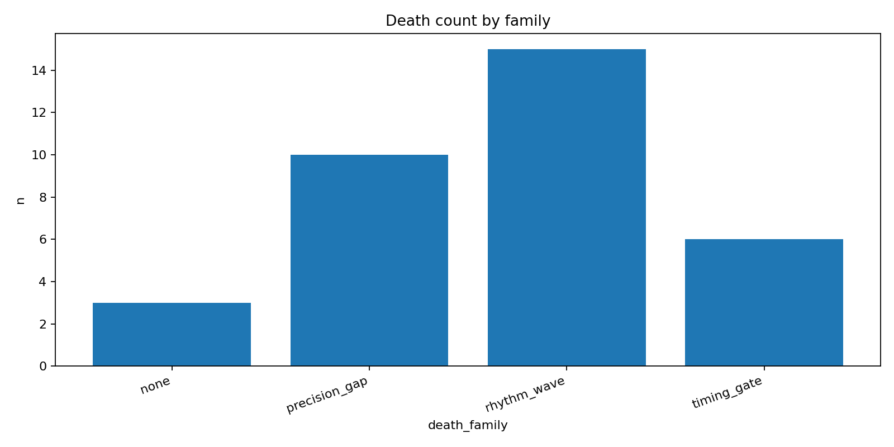
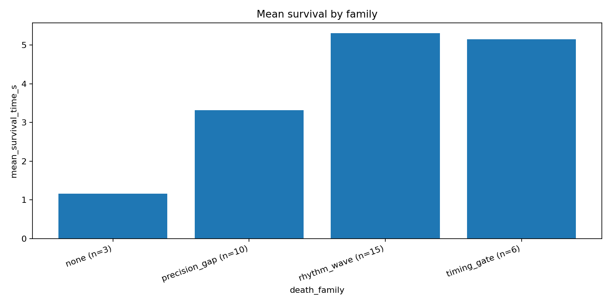
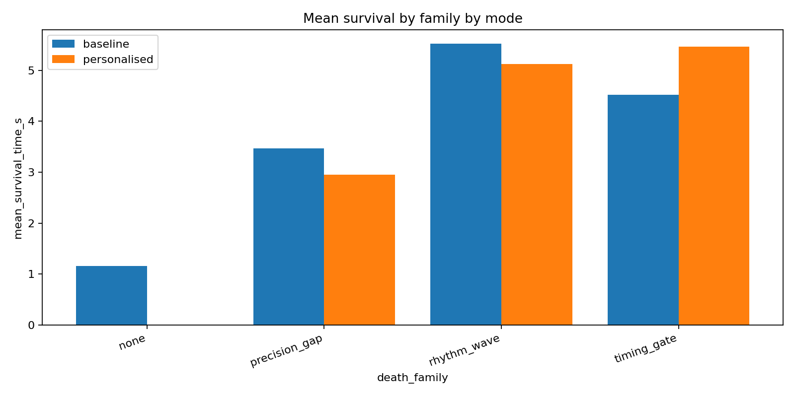

# Puff+ Portfolio Wrapper
Audience: SIT Applied AI admissions and technical review.

---

## Page 1 - Project Summary

Puff+ is a Flappy Bird-style prototype with run-level telemetry built for explainable adaptive gameplay.
Each run logs survival, score, death context, and input rhythm into `data/runs.csv`.
The game supports two modes in one executable: baseline control and personalised adaptation.
Mode is toggled live with the `M` key, so A/B-style data can be collected in one session.
`src/analyze_runs.py` converts raw logs into CSV summaries and report plots in `reports/`.
Current report set gives directional evidence on failure distribution and survival by obstacle family.

### What I built / Why it matters

What I built: an instrumented game loop (`src/main.py`) plus a reproducible analysis pipeline (`src/analyze_runs.py`) that outputs reviewer-ready tables and figures.

Why it matters: admissions and technical reviewers can inspect concrete telemetry, trace labels to source columns, and verify claims from raw logs to plots.

Gameplay screenshot placeholder: insert one in-game frame showing HUD (`Mode`, `Score`, `Time`) and at least one obstacle family on screen.

---

## Page 2 - Telemetry and Labels

Telemetry source: `data/runs.csv`

| runs.csv column | Meaning |
|---|---|
| `timestamp_epoch` | Unix timestamp at run end. |
| `player_id` | Player identifier. |
| `session_id` | Session identifier grouping multiple runs. |
| `run_id` | Sequential run number within a session. |
| `mode` | `baseline` or `personalised`. |
| `survival_time_s` | Run duration in seconds. |
| `score_passed_pipes` | Number of obstacles passed. |
| `death_reason` | End condition (`obstacle_collision`, `ground`, `ceiling`). |
| `obstacle_family` | Family at collision time for obstacle deaths; blank for non-obstacle deaths. |
| `tap_count` | Number of flap inputs in the run. |
| `tap_mean_interval_ms` | Mean interval between taps (ms). |
| `tap_sd_interval_ms` | Standard deviation of tap intervals (ms). |

Labeling note: analysis uses `death_family`, derived from `obstacle_family`; blank/missing values are normalized to `none` for grouping.

Mode note: baseline uses a fixed family cycle for control comparisons; personalised uses adaptive family selection and tuning. The `M` key toggles modes during gameplay so both conditions can be logged in the same session.

Report tables referenced on this page:
- `reports/summary_by_family.csv`
- `reports/death_count_by_family.csv`
- `reports/mean_survival_by_family_by_mode.csv`

---

## Page 3 - Results by Family

### Death Count by Family



`reports/death_count_by_family.csv` shows `rhythm_wave` (15), `precision_gap` (10), `timing_gate` (6), and `none` (3), total `n=34`.
This indicates deaths are not evenly distributed across families in the current sample.
Interpretation is directional because family exposure and run outcomes are affected by both spawn policy and limited sample size.

### Mean Survival by Family



`reports/summary_by_family.csv` reports mean survival of `5.308s` (`rhythm_wave`), `5.147s` (`timing_gate`), `3.316s` (`precision_gap`), and `1.158s` (`none`).
The `none` group (ground/ceiling, no obstacle family) is shortest, which is consistent with early-run control failures.
Family-level means are useful for ranking friction points, but they should not be treated as causal without larger balanced data.

---

## Page 4 - Baseline vs Personalised



`reports/mean_survival_by_family_by_mode.csv` shows mixed mode effects by family: `timing_gate` is higher in personalised (`5.46s`, n=4) than baseline (`4.52s`, n=2), while `precision_gap` and `rhythm_wave` are slightly higher in baseline in this sample.
Because several cells are small (for example, `timing_gate` baseline n=2), this is not enough evidence to claim a stable global winner.
Current by-mode output should be read as a checkpoint for iteration, not a final performance conclusion.

### Limitations

- Small total sample (`n=34`) and uneven counts across family/mode cells.
- Single player ID in current logs limits generalization across users.
- No confidence intervals or significance testing in current report set.
- Family exposure is policy-driven, so failure counts can reflect selection effects.
- Session effects (fatigue/warm-up) are not controlled yet.

### Next Steps

- Collect a larger, pre-balanced run set per family and mode.
- Add uncertainty metrics (CIs/error bars) to summary outputs.
- Stratify analysis by session order to separate learning from policy effects.
- Expand reviewer artifacts with per-run distributions, not only means.
- Add a fixed evaluation protocol (same duration and switching schedule each session).

### How to reproduce

```powershell
py src/main.py
py src/analyze_runs.py
```
